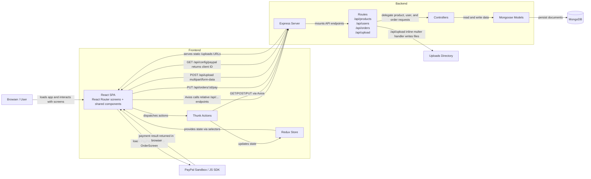

# Architecture Overview

This document captures the current runtime architecture of `proshop_mern` as it exists in the repository today. It focuses on the real request and data flow between the browser, the React/Redux frontend, the Express API, MongoDB, PayPal, and local file uploads.

## Runtime Flow

- Product browsing starts in the browser, where React Router renders screens such as `HomeScreen` and `ProductScreen`. Those screens dispatch thunk actions that call `/api/products`, and the backend resolves the request through routes, controllers, Mongoose models, and MongoDB before Redux updates the UI state.
- Authenticated checkout starts from cart and checkout screens in the React app. The browser keeps cart and user state in Redux and local storage, then thunk actions submit order requests to `/api/orders`, where the Express order controller validates the payload, rebuilds trusted order totals, and stores the order in MongoDB.
- PayPal payment starts on `OrderScreen`, which first requests `GET /api/config/paypal` to receive the sandbox client ID. The browser loads the PayPal JS SDK, completes the payment in the client, and then sends the payment result back to `PUT /api/orders/:id/pay`.
- Product image upload happens from the admin product edit screen. The browser sends `multipart/form-data` to `/api/upload`, the inline upload route writes the file into `uploads/`, and Express later serves that path back as a static `/uploads/...` asset.

## Notes / Current Boundaries

- The frontend uses relative `/api/...` URLs. In local development, Create React App proxies those requests to the backend port configured in `frontend/package.json`.
- In production mode, the Express server also serves `frontend/build`, so the API and the compiled frontend are hosted by the same backend process.
- On the backend, request handling is wrapped by Express JSON parsing, optional `morgan` logging in development, and shared not-found/error middleware.
- The main business APIs follow a route -> controller -> model pattern. The upload path is a legacy exception implemented as an inline `multer` route handler that writes directly to disk.
- This is a current-state architecture snapshot of the legacy app. It describes how the repository works today and does not propose a redesign.
