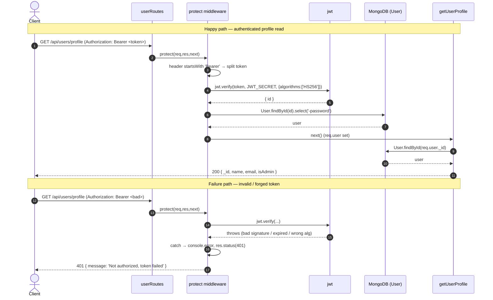

# Authentication & Users — Reverse-Engineering Spec

## 1. Overview

This document describes the authentication and user-management subsystem of the
`proshop_mern` backend as it currently behaves in source. It covers JWT issuance
and verification, the `protect` and `admin` route guards, the registration /
login / profile flows, the admin user-management endpoints, and password
hashing.

Authentication is stateless and bearer-token based. On successful login
(`POST /api/users/login`) or registration (`POST /api/users`) the server signs a
JWT with the user's Mongo `_id` as the only claim (`backend/utils/generateToken.js:4`)
using `process.env.JWT_SECRET` and a 30-day expiry. The token is returned in the
JSON response body; the client stores and replays it. There is no server-side
session store, no token blacklist, and no refresh mechanism — a token is valid
for its full 30-day lifetime and cannot be revoked.

Protected routes use the `protect` middleware (`backend/middleware/authMiddleware.js:5`),
which extracts a `Bearer` token from the `Authorization` header, verifies it with
`jwt.verify(..., { algorithms: ['HS256'] })`, loads the user by `decoded.id`
(stripping the password field), and attaches it to `req.user`. The `admin`
middleware (`backend/middleware/authMiddleware.js:35`) gates admin-only routes by
checking `req.user.isAdmin`.

Passwords are hashed with `bcryptjs` (cost factor 10) in a Mongoose `pre('save')`
hook (`backend/models/userModel.js:34`) and compared via the schema method
`matchPassword` (`backend/models/userModel.js:30`). Login responds with the same
generic `Invalid email or password` error whether the email is unknown or the
password is wrong (`backend/controllers/userController.js:23`), avoiding user
enumeration on that path.

Routes are wired in `backend/routes/userRoutes.js`. Public endpoints are register
and login; profile read/update require `protect`; user listing, fetch-by-id,
update, and delete require `protect` + `admin`. Controllers wrap their bodies in
`express-async-handler` so thrown errors propagate to the central error handler.
There is no rate limiting, no input validation / password policy, and self
profile update vs. admin update differ in which fields they accept.

## 2. Decision Table

| Condition | Then | Else | Edge case / notes |
| --- | --- | --- | --- |
| `Authorization` header present and starts with `Bearer` | Attempt token extraction + verify | Skip try block; `token` stays `undefined` → 401 `Not authorized, no token` | A header like `bearer xxx` (lowercase) or `Token xxx` fails the `startsWith('Bearer')` check (`authMiddleware.js:10`) |
| `jwt.verify` succeeds (signature, `HS256`, not expired) | Load `User.findById(decoded.id)`, set `req.user`, `next()` | Catch block → 401 `Not authorized, token failed` (`authMiddleware.js:22-25`) | `algorithms: ['HS256']` pin present (`authMiddleware.js:16`), closing the alg-confusion vector despite `jsonwebtoken@8.5.1` |
| Verified token's `decoded.id` matches no user | `req.user` set to `null`, `next()` called | — | Subsequent handlers dereferencing `req.user._id` throw; `admin` treats `null` as not-admin → 401 (`authMiddleware.js:36`) |
| `req.user && req.user.isAdmin` truthy | `admin` calls `next()` | 401 `Not authorized as an admin` (`authMiddleware.js:39-40`) | Uses 401 (auth) not 403 (forbidden) for an authenticated-but-unauthorized user |
| Login: user found AND `matchPassword` true | 200 + user fields + fresh token (`userController.js:14-20`) | 401 `Invalid email or password` | Same error for unknown email and bad password (no enumeration) |
| Register: `User.findOne({ email })` finds existing user | 400 `User already exists` (`userController.js:35-37`) | `User.create({ name, email, password })` | Race window: two concurrent registers can both pass the check before the unique index rejects one |
| Register: `User.create` returns truthy | 201 + user fields + token | 400 `Invalid user data` | `name` / `email` / `password` not validated beyond Mongoose `required`; no format/length checks |
| Profile update: `req.body.password` truthy | `user.password = req.body.password` (re-hashed on save) | password left unchanged | Empty string is falsy → password kept (`userController.js:88`) |
| Profile update: `req.body.name` / `email` falsy | Keep existing value (`x || user.x`) | Overwrite with provided value | Cannot clear a field to empty via this endpoint |
| Admin update: any request | `user.isAdmin = req.body.isAdmin` unconditionally (`userController.js:153`) | — | Missing `isAdmin` in body sets it to `undefined` → may fail `required: true` validation on save |
| Pre-save hook: `this.isModified('password')` false | `next()` called but no `return` → execution continues and re-hashes (`userModel.js:35-40`) | Generate salt + hash | Missing early `return` is a credential-corruption hazard (see Edge Cases) |

## 3. Sequence Diagram

## 4. Edge Cases

1. **Pre-save hook does not early-return** (`backend/models/userModel.js:34-41`).
   When `password` is unmodified the hook calls `next()` but does not `return`,
   so execution falls through to `bcrypt.genSalt` + `bcrypt.hash`, re-hashing the
   already-hashed value. Any `user.save()` that modifies only `name`/`email`
   (e.g. admin update or profile update without a new password) can corrupt the
   stored hash and lock the user out. This is the highest-severity issue here.

2. **Mass-assignment of `isAdmin` on admin update** (`backend/controllers/userController.js:153`).
   `user.isAdmin = req.body.isAdmin` is set unconditionally from the request
   body for any admin caller, with no whitelist. An admin can silently flip
   privilege on any account, and the absence of an `|| user.isAdmin` fallback
   means an omitted field becomes `undefined`.

3. **`isAdmin` omitted in admin update body** (`userController.js:153`). Because
   the assignment is unconditional, a PUT `/api/users/:id` that does not include
   `isAdmin` writes `undefined`, which violates the schema's `required: true`
   (`userModel.js:21`) and can fail the save with a validation error.

4. **No rate limiting on login or register** (`backend/routes/userRoutes.js:15-16`).
   No `express-rate-limit` (or equivalent) is wired anywhere, leaving
   `POST /login` open to credential brute-force and `POST /` open to
   registration spam.

5. **No input validation or password policy** (`userController.js:30-44`).
   Registration trusts `name`/`email`/`password` from the body with only
   Mongoose `required`. There is no email-format check, no minimum password
   length/complexity, and no trimming.

6. **30-day non-revocable token** (`backend/utils/generateToken.js:4-6`). The
   JWT lives 30 days with no server-side revocation, blacklist, or refresh. A
   leaked token is valid until it expires; password change does not invalidate
   outstanding tokens.

7. **Verified-but-deleted user** (`authMiddleware.js:19`). If a token verifies
   but `decoded.id` no longer exists, `User.findById` returns `null`, `req.user`
   becomes `null`, and `next()` is still called. Handlers that read
   `req.user._id` (e.g. `getUserProfile`, `userController.js:64`) then throw a
   `TypeError`, surfacing as a 500.

8. **Case-sensitive `Bearer` prefix** (`authMiddleware.js:10`). The guard uses
   `startsWith('Bearer')`; a lowercase `bearer` or alternate scheme is treated as
   no token → 401 `Not authorized, no token`, even when a valid token is present.

9. **Registration race condition** (`userController.js:33-44`). The existence
   check and `User.create` are not atomic; two concurrent requests for the same
   email can both pass `findOne` before either inserts. The `unique: true` index
   on `email` (`userModel.js:13`) is the only real guard, and the loser surfaces
   a raw duplicate-key error rather than the friendly 400.

10. **`getUsers` returns password hashes** (`userController.js:111-112`).
    `User.find({})` is returned without `.select('-password')` (unlike
    `getUserById` at `userController.js:134`), so the admin user-list response
    includes each user's bcrypt hash.

11. **`admin` failure uses 401 not 403** (`authMiddleware.js:39`). An
    authenticated non-admin hitting an admin route gets `401 Not authorized as an
    admin` rather than a 403, conflating "not authenticated" with "not
    permitted".

12. **Profile fields cannot be cleared** (`userController.js:86-87`). The
    `req.body.name || user.name` pattern means submitting an empty string keeps
    the old value, so a user cannot intentionally blank a field through this
    endpoint.

13. **Self-demotion / self-deletion not guarded** (`userController.js:118-128`,
    `147-167`). An admin can delete or demote their own account; there is no
    "last admin" or self-target protection.

## 5. Open Questions

- The pre-save hook's missing `return` (Edge Case 1) is clearly a defect in
  source; whether any deployed data has already been corrupted by it cannot be
  determined from code alone.
- `JWT_SECRET` strength/rotation is environment-driven and not visible in the
  repo; the spec assumes a single static secret as used by `generateToken` and
  `protect`.

## 6. Suggested Tests

- `protect rejects missing header` — request without `Authorization` returns 401 `Not authorized, no token`.
- `protect rejects tampered token` — altered signature returns 401 `Not authorized, token failed`.
- `protect rejects expired token` — token past 30-day expiry returns 401.
- `protect rejects non-HS256 token` — token signed with a different alg (or `none`) is refused by the `algorithms` pin.
- `protect handles deleted user` — valid token whose user was removed must not 500 with a `TypeError`.
- `admin blocks non-admin` — authenticated non-admin on an admin route returns 401/403.
- `login is generic on failure` — unknown email and wrong password both return identical `Invalid email or password`.
- `register rejects duplicate email` — second register with same email returns 400 `User already exists`.
- `password hashed once on register` — stored hash verifies against the plaintext exactly once (no double-hash).
- `profile update without password preserves hash` — saving only `name` must not re-hash / invalidate the password (regression for the pre-save hook).
- `admin update preserves isAdmin when omitted` — PUT without `isAdmin` should not blank or corrupt the flag.
- `getUsers never leaks password` — admin user-list response contains no `password` field.
- `non-admin cannot self-promote via profile update` — `isAdmin` in the profile-update body is ignored.
