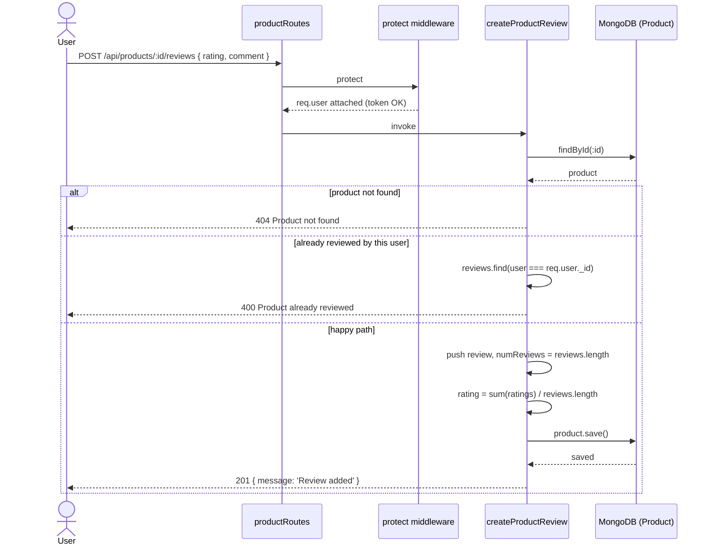

# Product Catalog — Reverse-Engineering Spec

## 1. Overview

The product catalog is the read-and-write surface for shop inventory. It is
implemented entirely in three backend files: the route table
(`backend/routes/productRoutes.js`), the controllers
(`backend/controllers/productController.js`), and the Mongoose schema
(`backend/models/productModel.js`). Access control is supplied by the shared
`protect` / `admin` middleware (`backend/middleware/authMiddleware.js`).

Seven endpoints are exposed. Three are public reads: paginated product listing
with optional keyword search (`GET /api/products`,
`getProducts`, productController.js:7), single-product detail
(`GET /api/products/:id`, `getProductById`, productController.js:31), and the
three top-rated products for the homepage carousel (`GET /api/products/top`,
`getTopProducts`, productController.js:154). One authenticated-user write lets a
logged-in customer post a review (`POST /api/products/:id/reviews`,
`createProductReview`, productController.js:113). Three admin-only writes cover
CRUD: create a placeholder product (`POST /api/products`, productController.js:60),
update it (`PUT /api/products/:id`, productController.js:80), and delete it
(`DELETE /api/products/:id`, productController.js:45).

The data model (`productModel.js`) embeds reviews as a sub-document array
(`reviews: [reviewSchema]`, productModel.js:46) and stores derived aggregates
(`rating`, `numReviews`) directly on the parent document, so review writes must
recompute and persist those aggregates.

Listing uses a fixed page size of 10 (productController.js:8) and a 1-based
`pageNumber` query param. Keyword search builds a case-insensitive `$regex`
filter directly from raw user input (productController.js:11-18). As flagged in
the consolidated code review (`homework/M6/stage1-code-review/synthesis.md`),
that regex is interpolated unsanitized (regex-injection / ReDoS exposure) and is
unindexed, so each request runs two full collection scans (`countDocuments` then
`find`). `getTopProducts` likewise sorts on an unindexed `rating` field on every
homepage load. None of the schema fields carry secondary indexes
(productModel.js), so these scans are the current steady-state behavior.

## 2. Decision Table

| Condition | Then | Else | Edge case / notes |
| --- | --- | --- | --- |
| `req.query.keyword` is truthy (getProducts, productController.js:11) | Build `{ name: { $regex: keyword, $options: 'i' } }` filter | Use empty filter `{}` (match all) | Empty string is falsy → returns all products; raw regex metacharacters are injected unescaped |
| `req.query.pageNumber` parses to a number (productController.js:9) | Use that page | Default to page 1 | `Number('abc')` → `NaN` → falsy → falls back to 1; page 0 / negative produce negative `skip` |
| `getProductById` finds a product (productController.js:34) | Return product JSON | 404 `Product not found` | Malformed ObjectId throws a CastError handled by global error middleware (not a clean 404) |
| `deleteProduct` finds a product (productController.js:48) | `deleteOne()` and return `Product removed` | 404 `Product not found` | No check that requester owns the product; any admin can delete any product |
| `createProduct` (productController.js:60) | Always create a hardcoded sample product owned by `req.user._id` | — | No request body is read; returns 201 |
| `updateProduct` finds a product (productController.js:93) | Overwrite all editable fields from body and save | 404 `Product not found` | Fields are assigned unconditionally; omitting a body field writes `undefined`, failing schema `required` validation on save |
| `createProductReview` finds a product (productController.js:118) | Proceed to duplicate check | 404 `Product not found` | — |
| User already in `product.reviews` (productController.js:119-123) | 400 `Product already reviewed` | Append review, recompute `numReviews` and `rating`, save | Duplicate check is by `user` id string equality |
| Route `/api/products/top` requested | Should hit `getTopProducts` | — | `/:id` is declared (line 14 `/`, line 17-21 `/:id`) but `/top` is on line 16 before the `/:id` block, so `/top` is matched first — confirm ordering safety in tests |
| `protect` middleware: valid Bearer token (authMiddleware.js:8) | Attach `req.user`, continue | 401 `Not authorized` | Used for review create and all admin writes |
| `admin` middleware: `req.user.isAdmin` truthy (authMiddleware.js:36) | Continue | 401 `Not authorized as an admin` | Applied to create/update/delete |

## 3. Sequence Diagram

## 4. Edge Cases

1. **Regex injection via keyword** — `req.query.keyword` is placed directly into
   `$regex` (productController.js:13-15). A crafted value like `(.*a){50}` or
   unbalanced groups can cause catastrophic backtracking (ReDoS) or alter the
   match semantics; no escaping is performed.
2. **Unindexed keyword scan** — both `countDocuments({...keyword})` and
   `find({...keyword})` (productController.js:20-21) run against an unindexed
   `name` regex, producing two full collection scans per listing request.
3. **Empty-string keyword** — an empty `keyword` query value is falsy
   (productController.js:11), so the filter becomes `{}` and the endpoint returns
   the full (paginated) catalog rather than "no matches".
4. **Non-numeric / missing pageNumber** — `Number(req.query.pageNumber) || 1`
   (productController.js:9) coerces `NaN` to 1, so garbage page params silently
   serve page 1.
5. **Out-of-range page** — `page = 0` yields `skip(pageSize * -1)` =
   `skip(-10)` and `page` is echoed back unvalidated (productController.js:23,25);
   pages beyond `pages` total return an empty `products` array.
6. **Malformed ObjectId in :id** — `findById` with an invalid id
   (productController.js:32, 46, 91, 116) throws a Mongoose CastError that is not
   converted to a clean 404; it surfaces through the global error handler instead.
7. **Duplicate review prevention** — `createProductReview` rejects a second
   review from the same user via string-compared `user` ids
   (productController.js:119-126); without this guard the rating average would be
   skewed by repeats.
8. **Full reviews re-reduction on every review** — each new review recomputes
   `numReviews` and re-reduces the entire embedded `reviews` array
   (productController.js:137-141) and rewrites the whole sub-document array on
   save; cost grows linearly with review count.
9. **Invalid rating value** — `rating` is coerced with `Number(rating)`
   (productController.js:130) but not bounded; a value like `1000` or a negative
   number is stored and pollutes the average (`rating` only requires a Number,
   productModel.js:6).
10. **Partial update writes undefined** — `updateProduct` assigns every field
    unconditionally (productController.js:94-100); a PUT missing any field sets it
    to `undefined`, and since all those fields are `required` (productModel.js),
    `save()` then fails validation rather than doing a partial patch.
11. **createProduct ignores the body** — it always inserts a hardcoded "Sample"
    product (productController.js:61-71); the real values must arrive via a
    follow-up `updateProduct` call, so a created-but-never-updated product leaks
    placeholder data into the catalog.
12. **Unindexed top-products sort** — `getTopProducts` sorts `{ rating: -1 }`
    with no supporting index (productController.js:155), so the homepage carousel
    triggers a sort over the full collection on each load.
13. **No ownership check on admin mutations** — `deleteProduct` /
    `updateProduct` only require the `admin` role (productRoutes.js:18-21), not
    ownership of the product (`user` field), so any admin can mutate any product.
14. **Route ordering for /top** — `/top` is registered (productRoutes.js:16)
    after the `/:id/reviews` route and before the `/:id` GET block
    (productRoutes.js:17-21); the literal `/top` path is matched before the
    `/:id` param route, so `top` is not interpreted as a product id.

## 5. Open Questions

1. Is there a global error-handling middleware that converts Mongoose CastErrors
   (malformed `:id`) into a 404/400, or do they propagate as 500s? The catalog
   controllers do not handle this themselves (productController.js:32).
2. Is `rating` expected to be constrained to 1–5 anywhere upstream (e.g. frontend
   or validation layer)? The model and controller accept any Number
   (productModel.js:6, productController.js:130).

## 6. Suggested Tests

- **listing_default_pagination** — `GET /api/products` returns ≤10 products with correct `page`/`pages`.
- **listing_keyword_filter** — keyword matches product names case-insensitively.
- **listing_keyword_regex_safety** — a regex-metacharacter keyword does not crash or hang the endpoint.
- **listing_invalid_pagenumber** — non-numeric `pageNumber` falls back to page 1.
- **product_detail_found / not_found** — valid id returns 200; unknown id returns 404.
- **product_detail_bad_objectid** — malformed `:id` returns a clean client error, not a 500.
- **review_happy_path** — authenticated user adds a review; `numReviews` and `rating` are recomputed.
- **review_duplicate_rejected** — same user posting twice gets 400 `Product already reviewed`.
- **review_requires_auth** — unauthenticated review post returns 401.
- **top_products_returns_three_sorted** — `GET /api/products/top` returns up to 3 products sorted by rating desc.
- **top_route_not_shadowed** — `/top` resolves to `getTopProducts`, not `getProductById('top')`.
- **admin_create_returns_sample** — `POST /api/products` creates a placeholder product (201) for an admin.
- **admin_update_partial_body** — PUT missing a required field is rejected by validation.
- **admin_guard** — non-admin user is blocked (401) from create/update/delete.
- **admin_delete_found / not_found** — delete returns `Product removed` or 404.
