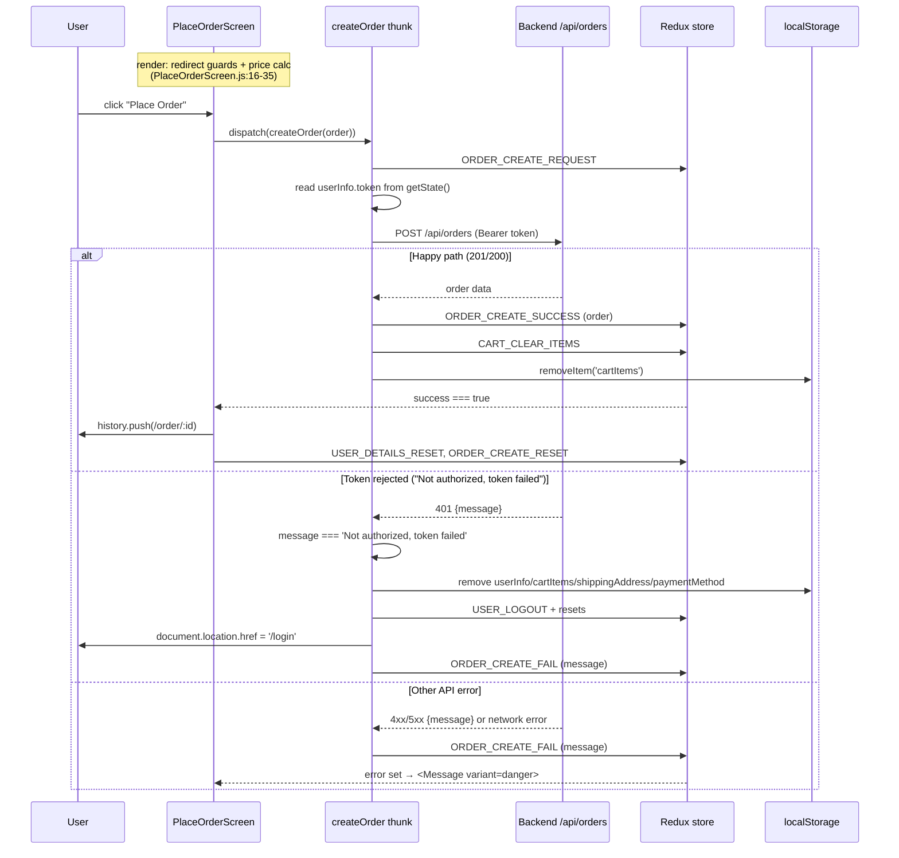

# Client State & Checkout — Reverse-Engineering Spec

## 1. Overview

This document specifies the frontend client-state subsystem of the storefront: the Redux store, its hydration from `localStorage`, the cart/shipping/payment/place-order checkout screens, and the client-side authentication/session handling that they depend on.

State is held in a single Redux store assembled in `frontend/src/store.js`. The store combines ~22 reducers (`store.js:33-56`) and is created with `redux-thunk` middleware and `redux-devtools-extension` always wired in (`store.js:78-84`). Three slices of state are seeded from `localStorage` at module load: `cartItems` and `shippingAddress` (under `cart`) and `userInfo` (under `userLogin`), each read with a bare `JSON.parse` and a presence-check ternary (`store.js:58-76`).

Checkout is a linear, screen-driven flow. `CartScreen` collects items (`addToCart`/`removeFromCart`, persisted to `localStorage` in `cartActions.js:24,33`). Its "proceed to checkout" button routes through `login?redirect=shipping` (`CartScreen.js:28-29`), forcing authentication. `ShippingScreen` saves the address (`cartActions.js:36-43`) then pushes to `/payment`. `PaymentScreen` saves a payment method (default `'PayPal'`, `PaymentScreen.js:16`) to `localStorage` (`cartActions.js:45-52`) then pushes to `/placeorder`. `PlaceOrderScreen` recomputes prices on every render, then `createOrder` POSTs to `/api/orders` with the user's bearer token, clears the cart on success, and redirects to the new order's page (`orderActions.js:25-66`, `PlaceOrderScreen.js:40-61`).

Auth/session is JWT-based and entirely client-persisted. `login`/`register`/`updateUserProfile` write the full server payload (including the token) into `localStorage.userInfo` (`userActions.js:53,105,181`). Every authenticated thunk attaches `Authorization: Bearer <token>` from store state. On any `'Not authorized, token failed'` API message, the thunk dispatches `logout`, which clears the four `localStorage` keys and hard-redirects to `/login` via `document.location.href` (`userActions.js:65-75`). There are no route-guard components; access control on checkout screens is inline `history.push` calls executed during render.

## 2. Decision Table

| Condition | Then | Else | Edge case / notes |
| --- | --- | --- | --- |
| `localStorage.cartItems` is present at store load (`store.js:58-60`) | `JSON.parse` it into `cart.cartItems` | seed `[]` | No try/catch — malformed JSON throws at module load, before React renders. |
| `localStorage.userInfo` present (`store.js:62-64`) | `JSON.parse` into `userLogin.userInfo` | seed `null` | Same unguarded parse; also the stored token may be expired/revoked — not validated client-side. |
| `localStorage.shippingAddress` present (`store.js:66-68`) | `JSON.parse` into `cart.shippingAddress` | seed `{}` | Same unguarded parse. |
| `localStorage.paymentMethod` present | (never read at load) | n/a | Written by `savePaymentMethod` (`cartActions.js:51`) but **not** hydrated in `store.js`; lost on refresh. |
| `CART_ADD_ITEM` and item already in cart (`cartReducers.js:19`) | replace existing line with new payload (overwrites qty) | append new line item | Match key is `product` id. |
| `PlaceOrderScreen` render and `!cart.shippingAddress.address` (`PlaceOrderScreen.js:16`) | `history.push('/shipping')` | check payment | Redirect runs as a side effect during render, not in an effect. |
| `PlaceOrderScreen` render and `!cart.paymentMethod` (`PlaceOrderScreen.js:18`) | `history.push('/payment')` | proceed to render summary | `paymentMethod` is not hydrated, so a refresh on this screen always bounces to `/payment`. |
| Place Order button `disabled` check (`PlaceOrderScreen.js:155`) | `disabled={cart.cartItems === 0}` | — | Compares an **array** to a number → always `false`; the button is never actually disabled, so empty-cart submit is reachable. |
| `itemsPrice > 100` (`PlaceOrderScreen.js:29`) | shipping = `0` | shipping = `100` | Free-shipping threshold; computed client-side and sent to server. |
| `createOrder` succeeds (`orderActions.js:44-52`) | dispatch `ORDER_CREATE_SUCCESS` + `CART_CLEAR_ITEMS`, `removeItem('cartItems')` | go to catch | `success` flag drives the redirect effect in `PlaceOrderScreen.js:40-47`. |
| Any authed thunk gets `'Not authorized, token failed'` (e.g. `orderActions.js:58`, `userActions.js:144`) | dispatch `logout()` → clear storage, hard redirect to `/login` | dispatch the slice's `_FAIL` with the message | Detection is exact string-match on the server message. |
| `PaymentScreen` render and `!shippingAddress.address` (`PaymentScreen.js:12-13`) | `history.push('/shipping')` | render form | Same render-phase redirect pattern. |
| User logs out (`userActions.js:65-75`) | remove `userInfo`, `cartItems`, `shippingAddress`, `paymentMethod`; reset slices; hard-navigate `/login` | — | Uses `document.location.href`, doing a full page reload (loses Redux state intentionally). |

## 3. Sequence Diagram

## 4. Edge Cases

1. **Unguarded JSON hydration crashes the app pre-render.** `store.js:58-68` calls `JSON.parse` on each of `cartItems`, `userInfo`, `shippingAddress` with no try/catch. A single malformed value (manual edit, truncated write, a different app sharing the origin) throws at module evaluation time, before React mounts — the user sees a blank page with no recovery path.
2. **Empty-cart order is submittable.** `PlaceOrderScreen.js:155` uses `disabled={cart.cartItems === 0}`, comparing an array to a number (always `false`). The Place Order button is therefore never disabled; clicking it with an empty cart dispatches `createOrder` with `orderItems: []`.
3. **`paymentMethod` is persisted but never re-hydrated.** `savePaymentMethod` writes `localStorage.paymentMethod` (`cartActions.js:51`), but `store.js` does not read it back. After a page refresh, `cart.paymentMethod` is `undefined`, so the `PlaceOrderScreen.js:18` guard bounces the user back to `/payment`.
4. **Long-lived JWT in `localStorage`.** The full login payload, including a 30-day token, is stored under `userInfo` (`userActions.js:53`). It is readable by any script on the origin (XSS-exposed) and cannot be revoked server-side before expiry.
5. **No client-side token expiry/validity check.** Hydration trusts whatever `userInfo.token` exists (`store.js:62-64`). An expired or tampered token is used on requests until the server returns `'Not authorized, token failed'`, only then triggering logout.
6. **Render-phase navigation side effects.** Redirect guards in `PlaceOrderScreen.js:16-20` and `PaymentScreen.js:12-14` call `history.push` directly during render rather than inside `useEffect`, which is a React anti-pattern (navigation as a render side effect) and can produce warnings or double-pushes.
7. **Prices are computed on the client and trusted as inputs.** `PlaceOrderScreen.js:22-35` computes `itemsPrice`, `shippingPrice`, `taxPrice`, `totalPrice` and `createOrder` sends them in the request body (`PlaceOrderScreen.js:55-58`). A modified client can submit arbitrary totals unless the server recomputes.
8. **Mutating Redux-derived state directly.** `PlaceOrderScreen.js:26-35` assigns onto the selected `cart` object (`cart.itemsPrice = ...`) — mutating a reference derived from the Redux store rather than using local variables/memoization.
9. **`addToCart` overwrites quantity instead of incrementing.** On `CART_ADD_ITEM` for an existing product, the reducer replaces the line item with the new payload (`cartReducers.js:19-25`), so re-adding sets qty to the latest value rather than summing — matching the `CartScreen` select-driven model but surprising for an "add" verb.
10. **Cart total uses unvalidated `qty`/`price` from `localStorage`.** The reduce in `PlaceOrderScreen.js:27` trusts each item's `price`/`qty` as hydrated from storage; corrupted or stale prices (e.g. product price changed server-side) are summed without revalidation before order creation.
11. **Logout does a full hard reload.** `logout` uses `document.location.href = '/login'` (`userActions.js:74`) rather than `history.push`, discarding the SPA and all in-memory Redux state; any unsaved client state is lost and the app fully re-bootstraps (re-running the unguarded hydration in edge case 1).
12. **Token-failure detection is brittle string matching.** Every authed thunk gates auto-logout on the exact message `'Not authorized, token failed'` (e.g. `orderActions.js:58,95,140,181,218,255`, `userActions.js:144`). Any other 401 wording (different middleware, proxy, or future server change) does not trigger logout; the user is left in a stuck authenticated-but-rejected state.
13. **No code-splitting; admin/PayPal/devtools ship to every shopper.** `store.js:1-3,78-84` always imports and wires `redux-devtools-extension` and the full reducer set (admin product/user/order management included). The bundle is monolithic, so non-admin shoppers download admin and payment-integration code.
14. **Cart and address persist across users on a shared device.** `cartItems`/`shippingAddress`/`paymentMethod` are origin-scoped, not user-scoped. They are only cleared on explicit `logout` (`userActions.js:66-69`) or on order success; switching accounts without logging out can carry one user's cart/address into another's session.

## 5. Open Questions

1. The store seeds `userLogin.userInfo` from storage but no slice re-validates the token against the server on app start; it is unclear whether any higher-level component (e.g. an app-shell effect) is intended to verify the session on load, or whether stale-token detection is meant to rely entirely on the per-request string match (edge case 12). No such bootstrap check exists in the files reviewed.
2. `PaymentScreen.js:34-41` renders a single radio that is hardcoded `checked` with a commented-out Stripe option; whether the `onChange` path is reachable (and thus whether `paymentMethod` can ever differ from `'PayPal'`) is ambiguous from this screen alone.

## 6. Suggested Tests

- **hydrate_malformed_cart_does_not_crash** — store import with invalid JSON in `localStorage.cartItems` should fall back to `[]`, not throw.
- **hydrate_missing_keys_uses_defaults** — empty `localStorage` yields `cartItems: []`, `userInfo: null`, `shippingAddress: {}`.
- **payment_method_survives_refresh** — after `savePaymentMethod`, a fresh store load should rehydrate `cart.paymentMethod` (currently fails).
- **place_order_button_disabled_when_empty** — with `cartItems: []`, the Place Order button is `disabled` and `createOrder` is not dispatched.
- **add_existing_item_quantity_behavior** — adding an in-cart product applies the documented qty semantics (overwrite per `cartReducers.js:19-25`).
- **create_order_success_clears_cart** — `ORDER_CREATE_SUCCESS` dispatches `CART_CLEAR_ITEMS` and removes `cartItems` from storage, then redirects to `/order/:id`.
- **token_failure_triggers_logout** — an authed thunk receiving `'Not authorized, token failed'` clears storage, dispatches `USER_LOGOUT`, and navigates to `/login`.
- **non_token_401_does_not_logout** — a 401 with a different message sets `_FAIL` but does not log the user out (documents brittleness).
- **shipping_guard_redirects_without_address** — visiting `/payment` or `/placeorder` with no `shippingAddress.address` redirects to `/shipping`.
- **logout_clears_all_persisted_keys** — `logout` removes `userInfo`, `cartItems`, `shippingAddress`, and `paymentMethod` from `localStorage`.
- **client_prices_match_server_recompute** — order totals computed in `PlaceOrderScreen` equal an independent server-side recomputation (guards edge case 7).
