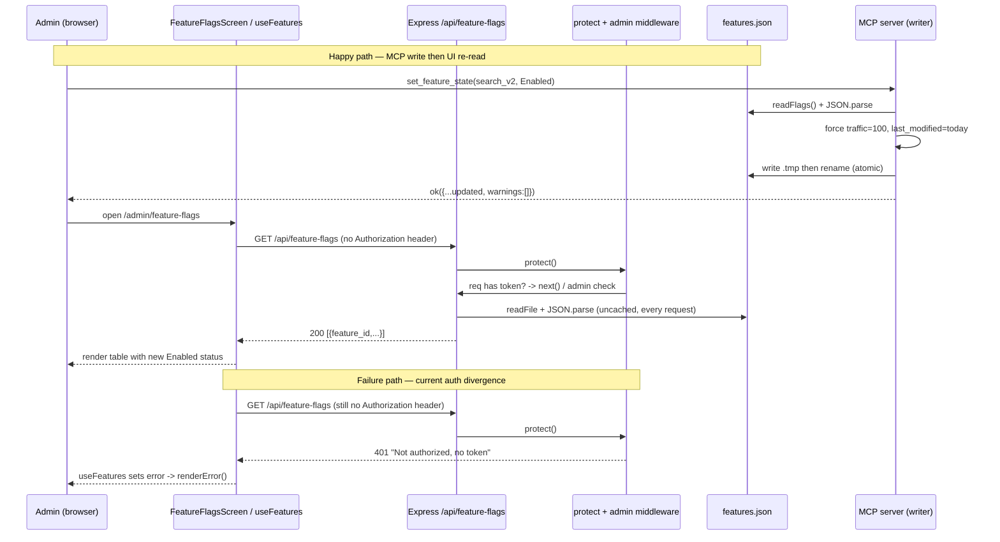

# Feature Flags — Reverse-Engineering Spec

## 1. Overview

The feature-flags subsystem manages a catalog of 25 product feature toggles for the proshop_mern storefront. The single source of truth is the JSON file `backend/features.json`, an object keyed by snake_case `feature_id`. Each value carries `name`, `description`, `status` (`Disabled` | `Testing` | `Enabled`), `traffic_percentage`, `last_modified` (YYYY-MM-DD), and optional `targeted_segments`, `rollout_strategy` (`canary` | `ab_test` | `full_release`), and `dependencies` (array of other feature_ids). See the shape at `backend/features.json:1-60`.

The file has **two independent owners with no shared access module**:

1. The **backend Express controller** (`backend/controllers/featureFlagController.js`) reads the file and exposes two read-only HTTP endpoints under `/api/feature-flags` (`backend/server.js:31`). It re-reads and `JSON.parse`s the entire file on every request with no caching (`featureFlagController.js:9-12`).
2. The **MCP management server** (`mcp/feature-flags/src/index.ts`) is the only writer. It exposes four stdio tools — `list_features`, `get_feature_info`, `set_feature_state`, `adjust_traffic_rollout` — and writes back atomically via temp-file-plus-rename (`index.ts:37-41`).

The admin UI is implemented **twice, with contradictory state patterns**:

- `frontend/src/screens/DashboardFeaturesScreen.js` — a Redux/axios read-only table mounted at `/admin/features` (`App.js:53`), backed by `featureFlagActions.js`, `featureFlagReducers.js`, and `featureFlagConstants.js`.
- `frontend/src/screens/admin/FeatureFlagsScreen.jsx` — a richer screen mounted at `/admin/feature-flags` (`App.js:54`) that bypasses Redux entirely and fetches through a local hook `frontend/src/screens/admin/hooks/useFeatures.js` (raw `fetch`). Its toggles and sliders are **local-only UI state**; the only path that persists a change is the Auto-Pilot panel, which POSTs to an external n8n webhook (`AutoPilotControls.jsx:16`), not to `/api/feature-flags`.

Neither frontend client sends an `Authorization` header, while the backend routes are now guarded by `protect, admin` (`featureFlagRoutes.js:9-10`) — a divergence detailed below and in the consolidated code review (`homework/M6/stage1-code-review/synthesis.md`).

## 2. Decision Table

| Condition | Then | Else | Edge case / notes |
|---|---|---|---|
| `GET /api/feature-flags` with valid admin Bearer token | 200, array of `{feature_id, ...feature}` | — | Controller maps the object to an array (`featureFlagController.js:19-23`) |
| Request has no `Authorization: Bearer` header | 401 "Not authorized, no token" | proceeds to `admin` check | `protect` runs first (`authMiddleware.js:29-32`); both FE clients omit the header, so both currently get 401 |
| Token valid but user not admin | 401 "Not authorized as an admin" | 200 | `admin` middleware (`authMiddleware.js:35-42`) |
| `GET /api/feature-flags/:featureId`, id exists | 200, single entry | 404 "Feature flag '<id>' not found" | `featureFlagController.js:31-35` |
| Controller JSDoc says `@access Public` | (documentation only) | — | Contradicts mounted routes which require `protect, admin` (`featureFlagController.js:18,27` vs `featureFlagRoutes.js:9-10`) |
| MCP `set_feature_state` state = `Disabled` | `traffic_percentage` forced to 0 | — | `canonicalTrafficForState` (`index.ts:46`) |
| MCP `set_feature_state` state = `Enabled` | `traffic_percentage` forced to 100 | — | `index.ts:47` |
| MCP `set_feature_state` state = `Testing` | keep current traffic if 1–99, else 10 | — | `index.ts:49` |
| `set_feature_state` to Testing/Enabled with a dependency not `Enabled` | returns non-empty `warnings`, write still succeeds | empty `warnings` | Warnings are advisory, never block (`index.ts:67-71,229-232`) |
| `set_feature_state` to `Disabled` | `warnings` always `[]` | dependency check runs | `index.ts:230` short-circuits dependency warnings on Disable |
| `adjust_traffic_rollout`, feature status ≠ `Testing` | error `WRONG_STATUS_FOR_ROLLOUT` | applies new percentage | `index.ts:291-297` |
| `adjust_traffic_rollout` percentage 0 / 100 (success) | success + `hint` to use Disabled/Enabled | `hint: null` | `index.ts:307-312` |
| MCP read fails to parse JSON | error `JSON_PARSE_ERROR`; other read failures `FILE_READ_ERROR` | proceeds | `safeRead` (`index.ts:98-108`) |
| FeatureFlagsScreen `?state=loading|error|empty` query param | renders that forced view | uses real fetch state | dev/demo override (`FeatureFlagsScreen.jsx:421-424`) |
| FeatureFlagsScreen visitor not admin | client-side `history.push('/login')` | renders screen | client-side guard only (`FeatureFlagsScreen.jsx:57-61`) |

## 3. Sequence Diagram

## 4. Edge Cases

1. **Auth-vs-client mismatch (functional break).** Routes require `protect, admin` (`featureFlagRoutes.js:9-10`), but `useFeatures.js:35` (`fetch('/api/feature-flags')`) and `featureFlagActions.js:12` (`axios.get('/api/feature-flags')`) send **no** `Authorization` header — unlike every other admin action (e.g. `productActions.js:121`). Both UIs therefore receive 401 and surface an error/empty state.
2. **JSDoc contradicts routes.** Controller comments declare `@access Public` (`featureFlagController.js:18,27`) while the mounted routes are admin-guarded. The documentation is stale relative to the wiring.
3. **No caching, re-parse per request.** `readFeatures()` reads and `JSON.parse`s the ~14KB file on every single request (`featureFlagController.js:9-12,20`); a public-facing list endpoint pattern with O(file size) work per call.
4. **Two writers vs readers, no shared schema.** The backend controller and the MCP server each embed their own knowledge of the file shape; the MCP defines a `Feature` TS interface (`index.ts:10-19`) the backend does not share, so schema drift is undetectable.
5. **`set_feature_state` to Disabled skips dependency warnings.** `index.ts:230` returns `[]` for Disable, so disabling a feature that others depend on emits no warning even though dependents may break.
6. **Testing traffic silently coerced.** Moving a feature to `Testing` with current traffic of 0 or ≥100 resets it to 10 (`index.ts:49`), changing rollout share as a side effect of a status change.
7. **`adjust_traffic_rollout` status lock.** It refuses any feature not in `Testing` (`index.ts:291-297`); callers must first run `set_feature_state` to Testing, which itself rewrites traffic — a two-step dance with intermediate side effects.
8. **Dangling dependency references.** `dependencyWarnings` warns (but does not error) when a listed dependency id is absent from the file (`index.ts:60-65`); a typo'd dependency only produces an advisory string.
9. **404 only on single-flag route.** `getFeatureFlag` 404s for unknown ids (`featureFlagController.js:31-35`), but the list route never 404s and would happily return `[]` if the file held an empty object.
10. **Client-only admin guard on FeatureFlagsScreen.** The redirect at `FeatureFlagsScreen.jsx:57-61` is the only access control on the rich screen; it runs in the browser and protects nothing server-side. (DashboardFeaturesScreen has the same client redirect at `DashboardFeaturesScreen.js:17-23`.)
11. **Local-only toggles/sliders.** Toggling a flag or moving a slider in FeatureFlagsScreen mutates React state only (`FeatureFlagsScreen.jsx:401-410, 347-357`) and is never persisted to `features.json`; a page reload discards every change except those made through the Auto-Pilot/n8n path.
12. **`effectiveStatus` invents a status.** An originally-`Disabled` feature toggled on is shown as `Enabled` (`FeatureFlagsScreen.jsx:28-33`), a value never written anywhere — the badge can disagree with the backend.
13. **Persistence goes to a different service.** The only write path from the UI is `AutoPilotControls.jsx:16` POSTing to an external n8n webhook (`/feature-control`), not the backend; the backend API has no write route at all.
14. **MCP path resolution is multi-source.** `FEATURES_PATH` falls back through `FEATURES_JSON_PATH` env var → `process.argv[2]` → a hardcoded relative path to `backend/features.json` (`index.ts:24-27`); a misconfigured launch can silently point the writer at the wrong file.
15. **Schema validation rejects before handler.** `set_feature_state` `state` is a Zod enum and `adjust_traffic_rollout` `percentage` is `int().min(0).max(100)` (`index.ts:187,257-264`); the handler's redundant manual re-checks (`index.ts:200-206,274-280`) are effectively dead for SDK-validated calls.

## 5. Open Questions

1. Was the move to `protect, admin` on the routes intentional given that no frontend client sends a token? If so, the two UIs are currently non-functional against this API and need the `Authorization` header added (or a deliberate public read endpoint).
2. Is the `/admin/features` (Redux) screen intended to be retired in favor of `/admin/feature-flags`, or are both meant to coexist? No code marks either as deprecated.
3. Does any consumer rely on the controller's `@access Public` contract (e.g. a storefront reading flags anonymously)? If yes, the admin guard is a regression.

## 6. Suggested Tests

- `routes_require_admin` — GET `/api/feature-flags` without a token returns 401; with admin token returns 200 array.
- `frontend_sends_auth_header` — `useFeatures` and `listFeatureFlags` include `Authorization: Bearer <token>` so requests pass the guard.
- `single_flag_404` — GET `/api/feature-flags/does_not_exist` returns 404 with the not-found message.
- `set_state_disabled_zeroes_traffic` — `set_feature_state(x, 'Disabled')` writes `traffic_percentage: 0` and empty `warnings`.
- `set_state_enabled_maxes_traffic` — `set_feature_state(x, 'Enabled')` writes `traffic_percentage: 100`.
- `set_state_testing_canary_default` — Testing from 0 or ≥100 resets traffic to 10; an in-range value is preserved.
- `dependency_warning_on_promote` — promoting a feature whose dependency is not Enabled returns a non-empty `warnings` array but still writes.
- `adjust_rollout_status_lock` — `adjust_traffic_rollout` on a non-Testing feature returns `WRONG_STATUS_FOR_ROLLOUT` and does not write.
- `adjust_rollout_boundary_hints` — percentage 0 and 100 return the Disabled/Enabled `hint`; mid values return `hint: null`.
- `mcp_atomic_write` — a failed write leaves the original `features.json` intact (temp-then-rename).
- `mcp_bad_json_read` — corrupt `features.json` yields `JSON_PARSE_ERROR`, not an unhandled crash.
- `ui_toggle_not_persisted` — toggling a row in FeatureFlagsScreen does not issue any `/api/feature-flags` write and resets on reload.
