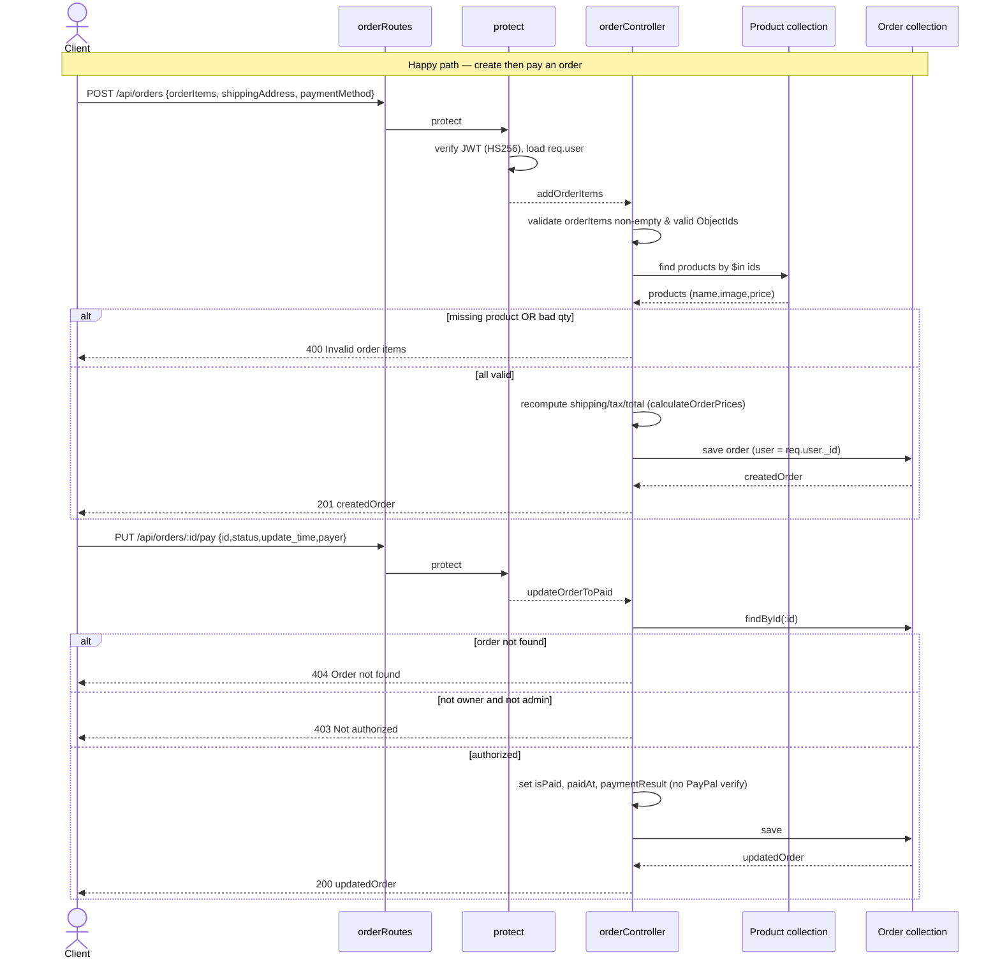

# Orders — Reverse-Engineering Spec

## 1. Overview

The order subsystem manages the lifecycle of a customer purchase: creating an
order from a cart, recording payment, marking delivery, and reading orders back
(per-user and admin-wide). It lives in three backend files:

- `backend/models/orderModel.js` — the Mongoose `Order` schema.
- `backend/controllers/orderController.js` — six request handlers.
- `backend/routes/orderRoutes.js` — route wiring and auth middleware.
- `backend/middleware/authMiddleware.js` — `protect` (JWT auth) and `admin`
  (role gate) used by the routes.

An `Order` document (`backend/models/orderModel.js:3-74`) holds a `user`
reference, a denormalized `orderItems` array (name/qty/image/price/product per
line), a `shippingAddress`, `paymentMethod`, computed money fields
(`taxPrice`, `shippingPrice`, `totalPrice`), and two state pairs:
`isPaid`/`paidAt` and `isDelivered`/`deliveredAt`, plus a `paymentResult`
sub-document. `timestamps: true` adds `createdAt`/`updatedAt`.

Key responsibilities and current behavior:

- **Creation** (`addOrderItems`, `orderController.js:22-91`): validates that
  order items exist and reference valid product IDs, loads the real products
  from the database, rebuilds each line from trusted product data
  (name/image/price), and recomputes `shippingPrice`/`taxPrice`/`totalPrice`
  server-side via `calculateOrderPrices`. Client-supplied prices are ignored.
- **Server-side pricing** (`calculateOrderPrices`, `orderController.js:8-17`):
  items total = Σ(price × qty); free shipping over 100, else 100; tax = 15% of
  items; total = items + shipping + tax.
- **Ownership authorization**: `getOrderById` and `updateOrderToPaid` enforce
  that the requester owns the order or is an admin. `updateOrderToDelivered`
  and `getOrders` are admin-only via the `admin` middleware.
- **Pay/deliver lifecycle**: `updateOrderToPaid` flips `isPaid`;
  `updateOrderToDelivered` flips `isDelivered`.

The consolidated code review (`homework/M6/stage1-code-review/synthesis.md`)
previously flagged several issues here; the current code has addressed
authorization and price-trust concerns but retains performance gaps
(no `user` index, unpaginated list endpoints) and a missing PayPal
server-side verification.

## 2. Decision Table

| Condition | Then | Else | Edge case / notes |
|-----------|------|------|-------------------|
| `addOrderItems`: `orderItems` not an array OR empty (`orderController.js:25`) | 400 "No order items" | continue | Guards null/undefined and `[]` |
| `addOrderItems`: any unique product id fails `ObjectId.isValid` (`:34-41`) | 400 "Invalid order items" | continue | `item.product` may be missing → `undefined` id, caught here |
| `addOrderItems`: `products.length !== uniqueProductIds.length` (`:50-53`) | 400 "Invalid order items" | continue | Some referenced product not found in DB |
| `addOrderItems`: per item `!product` OR `qty` not integer OR `qty <= 0` (`:61-64`) | 400 "Invalid order items" | push normalized line | `qty` coerced via `Number()`; fractional/zero/negative rejected |
| `addOrderItems`: items total > 100 (`:12`) | `shippingPrice = 0` | `shippingPrice = 100` | Threshold is strict `>` (exactly 100 → 100 shipping) |
| `addOrderItems`: all validations pass | save order, 201 with order | — | Prices always recomputed; client prices ignored |
| `getOrderById`: order found (`:102`) | check ownership | 404 "Order not found" | `req.params.id` invalid ObjectId → cast error thrown by Mongoose |
| `getOrderById`: requester not owner AND not admin (`:103`) | 403 "Not authorized to view this order" | return order JSON | Owner or admin may view |
| `updateOrderToPaid`: order found (`:121`) | check ownership | 404 "Order not found" | — |
| `updateOrderToPaid`: requester not owner AND not admin (`:122`) | 403 "Not authorized" | set paid, save, return | No verification that payment actually occurred |
| `updateOrderToPaid`: success path (`:127-138`) | `isPaid=true`, `paidAt=now`, store `paymentResult` from `req.body` | — | Reads `req.body.payer.email_address` (`:133`) — throws if `payer` absent |
| `updateOrderToDelivered`: order found (`:151`) | `isDelivered=true`, `deliveredAt=now`, save | 404 "Order not found" | Admin-only via route middleware; no extra ownership check needed |
| `getMyOrders` (`:167-169`) | return all orders where `user == req.user._id` | — | Unfiltered/unpaginated; full scan (no index on `user`) |
| `getOrders` (`:175-177`) | return all orders, populate user id/name | — | Admin-only; unpaginated (entire collection) |
| `protect`: header has `Bearer` token, JWT verifies (`authMiddleware.js:8-21`) | set `req.user`, `next()` | 401 "token failed" / "no token" | HS256 enforced; password stripped |
| `admin`: `req.user.isAdmin` truthy (`authMiddleware.js:36`) | `next()` | 401 "Not authorized as an admin" | — |

## 3. Sequence Diagram

## 4. Edge Cases

1. **No server-side payment verification** (`orderController.js:118-138`):
   `updateOrderToPaid` marks an order paid using only `req.body`. An
   authenticated owner can mark their own order paid without any real PayPal
   capture/verification. The flagged IDOR (any user paying any order) is now
   closed by the ownership check at `:122`, but the order can still be falsely
   marked paid by its owner.

2. **`req.body.payer.email_address` crash** (`orderController.js:133`): if a
   client calls `/pay` with a body lacking `payer`, accessing
   `req.body.payer.email_address` throws `TypeError: Cannot read properties of
   undefined`, surfacing as a 500. Malicious or malformed PayPal payloads break
   the handler.

3. **Invalid `:id` cast error** (`getOrderById`/`updateOrderToPaid`/
   `updateOrderToDelivered`): a non-ObjectId `:id` makes Mongoose `findById`
   throw a `CastError` rather than a clean 404; error shape depends on the
   global error handler.

4. **No index on `order.user`** (`orderModel.js:5-9`): `getMyOrders`
   (`:168`) issues `find({ user })` against an unindexed field — a full
   collection scan that degrades as the collection grows.

5. **Unpaginated admin list** (`getOrders`, `orderController.js:175-177`):
   returns every order with populated user — an unbounded payload that grows
   without limit; a large collection can exhaust memory/bandwidth.

6. **Unpaginated `getMyOrders`** (`:167-169`): a user with many orders gets
   the entire history in one response; no `limit`/`skip`.

7. **Float money arithmetic** (`calculateOrderPrices`, `:8-17`): prices are
   JS `Number`s rounded via `Math.round(num*100)/100`. Accumulated rounding
   on large carts can drift; money is not stored as integer cents.

8. **Duplicate line items collapse on validation but not on order** 
   (`addOrderItems`, `:30-32` vs `:55-73`): `uniqueProductIds` dedups for the
   product lookup, but the loop iterates the raw `orderItems`, so a client
   sending the same product twice creates two separate order lines (each
   priced from trusted data) — totals are correct but lines are not merged.

9. **No stock check / decrement** (`addOrderItems`): orders are created with
   no verification of `countInStock` and no inventory decrement, so quantities
   exceeding stock are accepted and overselling is possible.

10. **`shippingAddress`/`paymentMethod` not validated in controller**
    (`addOrderItems`, `:23,:81-82`): these come straight from `req.body`.
    Validation relies solely on schema `required` at save; a missing nested
    `shippingAddress` field causes a Mongoose validation error (500-ish),
    while extra/unexpected fields are silently dropped.

11. **Double-pay / re-pay not guarded** (`updateOrderToPaid`): there is no
    `if (order.isPaid) return` short-circuit, so repeated calls overwrite
    `paidAt` and `paymentResult` each time — last write wins, masking the
    original payment timestamp.

12. **Concurrent updates lost** (`findById` then `save`,
    `:119-136` / `:149-155`): the read-modify-write pattern has no optimistic
    locking; simultaneous pay and deliver requests can clobber each other's
    field updates (no `__v` version guard enforced on save semantics here).

13. **`getOrders` admin gate vs route comment mismatch is fine, but pay/deliver
    route verbs**: route comments say `GET /api/orders/:id/pay` and
    `/deliver` (`:116`,`:146`) while the router registers them as `PUT`
    (`orderRoutes.js:16-17`). The PUT wiring is authoritative; the comments are
    stale and could mislead an integrator into calling GET.

## 5. Open Questions

1. **PayPal verification intent**: is server-side capture verification expected
   to live in `updateOrderToPaid`, or is verification delegated to a webhook /
   the frontend SDK elsewhere? The current handler trusts `req.body` entirely.
2. **Expected behavior for duplicate product lines**: should `addOrderItems`
   merge duplicate `product` entries by summing `qty`, or is creating separate
   lines intentional?
3. **Inventory model**: is stock decrement intended to happen at order creation,
   at payment, or out of band? No code path touches `countInStock`.

## 6. Suggested Tests

- `addOrderItems rejects empty cart` — POST with `orderItems: []` returns 400
  "No order items".
- `addOrderItems rejects invalid product id` — POST with a non-ObjectId
  `product` returns 400 "Invalid order items".
- `addOrderItems rejects unknown product` — valid ObjectId not in DB returns
  400 (length mismatch branch).
- `addOrderItems rejects non-positive qty` — `qty: 0` and `qty: -1` and
  `qty: 1.5` each return 400.
- `addOrderItems ignores client prices` — POST with bogus `totalPrice: 0`;
  saved order has server-recomputed total.
- `addOrderItems free shipping boundary` — items total of exactly 100 charges
  100 shipping; 100.01 charges 0.
- `getOrderById blocks non-owner non-admin` — user B requesting user A's order
  returns 403.
- `getOrderById allows admin` — admin reading another user's order returns 200.
- `getOrderById 404 for missing order` — unknown valid ObjectId returns 404.
- `updateOrderToPaid blocks non-owner` — user B paying user A's order returns
  403.
- `updateOrderToPaid handles missing payer` — body without `payer` does not
  500 the server (currently fails — documents bug #2).
- `updateOrderToPaid is idempotent / guards re-pay` — second call does not
  overwrite original `paidAt` (currently fails — documents bug #11).
- `updateOrderToDelivered requires admin` — non-admin returns 401 at the route.
- `getMyOrders returns only caller's orders` — user A sees no orders belonging
  to user B.
- `getOrders requires admin` — non-admin returns 401 "Not authorized as an
  admin".
