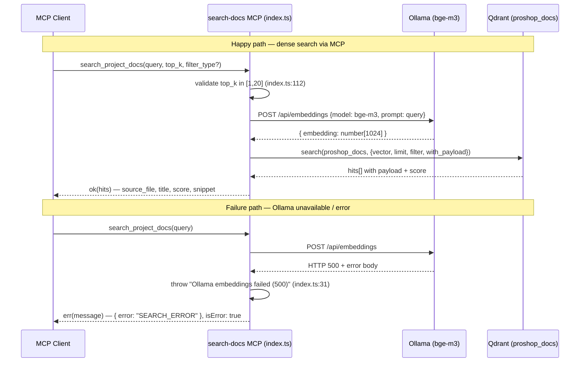

# Document Retrieval (RAG + Search MCP) — Reverse-Engineering Spec

## 1. Overview

This subsystem provides semantic retrieval over the `proshop_mern` documentation corpus. It has two clearly separable halves that do not currently meet.

The **served interface** is a Model Context Protocol (MCP) stdio server at `mcp/search-docs/src/index.ts`. It registers a single tool, `search_project_docs` (`index.ts:69`), which embeds the caller's query with an Ollama `bge-m3` model (`index.ts:23-36`) and runs a **dense-only** cosine search against the Qdrant collection `proshop_docs` (`index.ts:118-123`). It supports `top_k` (1–20, default 5) and optional `filter_type` / `filter_source_file` Qdrant payload filters (`index.ts:38-43`). This is the only retrieval path reachable by an MCP client.

The **CLI half** lives under `rag/` and is richer but detached:
- `rag/ingest.ts` — builds the dense `proshop_docs` collection from `rag/chunks.jsonl` (1024-dim, Cosine).
- `rag/query.ts` — a CLI mirror of the MCP dense search against `proshop_docs`.
- `rag/ingest-hybrid.ts` — builds a **different** collection, `proshop_docs_hybrid`, holding named `dense` vectors plus an `idf`-modified `sparse` vector (BM25-style, `ingest-hybrid.ts:116-119`).
- `rag/hybrid.ts` — dense + sparse retrieval fused with Reciprocal Rank Fusion (RRF) against `proshop_docs_hybrid`.
- `rag/hybrid-rerank.ts` — hybrid retrieval of a 25-candidate pool, then cross-encoder reranking.
- `rag/rerank.ts` + `rag/rerank.py` — a Node wrapper that spawns a Python `CrossEncoder` (`BAAI/bge-reranker-v2-m3`) per call.
- `rag/bm25.ts` — query/document tokenizer and DJB2-hashed sparse-vector builder.

**Key architectural divergence:** the best-quality path (hybrid + rerank) exists *only* as CLI scripts against `proshop_docs_hybrid`. The MCP tool serves dense-only against `proshop_docs`. An MCP client therefore cannot reach hybrid or rerank, and the two collections are independently ingested. The embedding helper and Qdrant client setup are copy-pasted across roughly six files (the MCP server, `query.ts`, `hybrid.ts`, `hybrid-rerank.ts`, `ingest.ts`, `ingest-hybrid.ts`). `OLLAMA_URL` and `QDRANT_URL` are read unvalidated from the environment in every file.

## 2. Decision Table

| Condition | Then | Else | Edge case / notes |
| --- | --- | --- | --- |
| MCP `top_k` is non-integer, `< 1`, or `> 20` (`index.ts:112`) | Return `SEARCH_ERROR` with `isError: true` | Use `top_k` (default 5, `index.ts:110`) | Validation only in MCP; `query.ts:69` only rejects `<= 0` / non-finite, allows huge values |
| `filter_type` and/or `filter_source_file` supplied (`index.ts:38-43`) | Build a Qdrant `must` filter restricting payload `type` / `source_file` | `filter` is `undefined` → unfiltered search | An invalid `filter_type` value silently yields 0 hits (no validation against the documented enum) |
| Ollama `/api/embeddings` returns non-2xx (`index.ts:29`) | Throw → caught → `SEARCH_ERROR` with the body text | Parse JSON `embedding` | MCP wraps in try/catch (`index.ts:138`); CLIs let it crash the process |
| Ollama response missing `embedding` (`index.ts:34`) | Throw `'Ollama response is missing embedding'` | Return the vector | MCP does **not** check vector length; `ingest.ts:115` / `ingest-hybrid.ts:88` enforce length === 1024 |
| Embedding length ≠ 1024 during ingest (`ingest.ts:115`) | Throw `Unexpected embedding size` | Upsert the batch | Query/MCP paths skip this check; a wrong model would search with a mismatched vector |
| Hybrid query (`hybrid.ts:29`) | Prefetch 25 dense + 25 sparse, fuse with RRF, return `topK` | — | Uses `client.query` (not `.search`); requires `proshop_docs_hybrid` to exist |
| Hybrid-rerank query (`hybrid-rerank.ts:31`) | Hybrid-fetch pool of 25, rerank, slice `topK` | — | Spawns a fresh Python process per query (cold model load each time, `rerank.ts:19`) |
| `rerank.py` child exits non-zero (`rerank.ts:24-26`) | Reject with `rerank.py exit <code>: <stderr>` | `JSON.parse(stdout)` | If stdout is not valid JSON on exit 0, `JSON.parse` throws an uncaught rejection |
| BM25 token after cleanup is `< 2` chars or a stop word (`bm25.ts:16`) | Drop the token | Hash with DJB2 → uint32 index (`bm25.ts:19-22`) | Hash collisions across distinct tokens map to the same sparse index |
| Query produces zero in-vocabulary BM25 tokens | Sparse vector is empty `{indices:[], values:[]}` | Non-empty sparse vector | Hybrid still works via the dense prefetch branch only |
| `rag/chunks.jsonl` empty (`ingest.ts:162`) | Throw `No chunks found` | Recreate collection + upsert | Same guard in `ingest-hybrid.ts:111` |

## 3. Sequence Diagram

## 4. Edge Cases

1. **top_k bounds enforced only in MCP.** `index.ts:112` rejects non-integer / `<1` / `>20`. The CLI `query.ts:69` only rejects `<= 0` and non-finite, so `--top-k 9999` is accepted and forwarded to Qdrant.
2. **Unvalidated `filter_type`.** The tool description lists a valid enum (`adr | api | ... | analysis`, `index.ts:94`), but no code validates it. A typo produces a syntactically valid Qdrant filter that matches nothing, returning an empty result with no error.
3. **No embedding-length check on the query side.** `index.ts:34` and `query.ts:95` only check that `embedding` is present, not that it is 1024-dim. A model mismatch would silently search with a wrong-size vector (Qdrant would reject or mis-score).
4. **Collection divergence.** `ingest.ts` writes `proshop_docs`; `ingest-hybrid.ts` writes `proshop_docs_hybrid`. The MCP serves the former; hybrid/rerank read the latter. If only one ingest has run, the other path's collection is missing and queries fail.
5. **`recreateCollection` is destructive.** Both `ingest.ts:88` and `ingest-hybrid.ts:116` call `recreateCollection`, which drops and rebuilds the collection on every run — any concurrent search during ingest hits a missing/partial collection.
6. **Per-query cold model load in rerank.** `rerank.ts:19` spawns a new Python process for every call, and `rerank.py:6` loads `BAAI/bge-reranker-v2-m3` on import. Every reranked query pays the full model-load cost.
7. **rerank stdout parsing is unguarded on success.** `rerank.ts:26` does `JSON.parse(out)` when exit code is 0. Any non-JSON stdout (e.g., a stray warning printed to stdout) throws an uncaught promise rejection rather than a clean error.
8. **Hardcoded Python venv path.** `rerank.ts:8-12` resolves `.venv/bin/python` relative to `rag/`. If the venv is absent or the platform branch is wrong, `spawn` fails and the rerank path is unusable.
9. **BM25 hash collisions.** `bm25.ts:19-22` maps tokens to uint32 via DJB2 with no collision handling. Two distinct tokens hashing to the same index merge their frequencies, distorting sparse scores. The comment acknowledges collisions are "rare," not absent.
10. **Empty sparse vector for short / stop-word-only queries.** `bm25.ts:16` drops tokens under 2 chars and stop words (English + Russian). A query like "is it" yields an empty sparse vector; hybrid then relies solely on the dense prefetch.
11. **SSRF surface via environment URLs.** `OLLAMA_URL` and `QDRANT_URL` are taken unvalidated from the environment in every file (e.g., `index.ts:6-7`) and used directly in `fetch` / client construction. A poisoned environment value can redirect embedding/search traffic to an attacker-controlled host.
12. **Snippet truncation hides matches.** `snippet()` collapses whitespace and slices to 200 chars (`index.ts:45-48`); `hybrid-rerank.ts:58` slices 200 chars *without* whitespace collapse. The substring that caused a hit may fall outside the returned snippet.
13. **Embedding text enrichment must match between ingest and hybrid ingest.** `buildEmbeddingText` (`ingest.ts:122` and `ingest-hybrid.ts:69`) concatenates title, headings, keywords, summary, and text. The two copies are independent; if they drift, dense vectors in the two collections become inconsistent.
14. **No retry / timeout on Ollama or Qdrant calls.** All `fetch` and Qdrant client calls run without explicit timeout or retry; a slow Ollama hangs the MCP request indefinitely.

## 5. Open Questions

1. Is `proshop_docs_hybrid` ever intended to back the MCP tool, or are the hybrid/rerank CLIs purely experimental? The code shows no wiring from MCP to the hybrid path.
2. The sparse vector is described as "BM25" via `idf` modifier in Qdrant (`ingest-hybrid.ts:118`), but the document side stores raw term frequencies (`bm25.ts:33-37`). Whether the intended BM25 length-normalization (the `b`/`k1` terms) is delegated entirely to Qdrant's `idf` scoring is not documented in code.
3. `OLLAMA_MODEL` is hardcoded to `bge-m3` in the MCP (`index.ts:9`) but environment-overridable in the CLIs. Whether the MCP should honor the env override (to stay consistent with ingest) is unclear.

## 6. Suggested Tests

- `mcp_top_k_rejects_out_of_range` — `top_k = 0`, `21`, and `2.5` each return `SEARCH_ERROR` / `isError`.
- `mcp_default_top_k_is_five` — omitting `top_k` searches Qdrant with `limit: 5`.
- `mcp_filter_builds_must_clause` — `filter_type` + `filter_source_file` produce a two-key Qdrant `must` filter; neither produces `undefined`.
- `mcp_ollama_error_surfaces_as_search_error` — a 500 from Ollama yields `{ error: "SEARCH_ERROR" }` with `isError: true`.
- `mcp_missing_embedding_throws` — a response without `embedding` produces a clean error, not a crash.
- `ingest_rejects_wrong_embedding_size` — a non-1024 vector throws `Unexpected embedding size`.
- `ingest_empty_chunks_throws` — an empty `chunks.jsonl` throws `No chunks found`.
- `bm25_drops_stopwords_and_short_tokens` — stop words and 1-char tokens are excluded from indices.
- `bm25_empty_for_stopword_only_query` — a stop-word-only query returns empty `indices`/`values`.
- `bm25_token_id_is_stable_uint32` — `tokenId` is deterministic and within uint32 range.
- `hybrid_uses_rrf_fusion_over_two_prefetches` — `client.query` is called with dense+sparse prefetch and `fusion: 'rrf'`.
- `hybrid_rerank_pool_is_25_then_sliced` — reranker receives 25 candidates and the result is sliced to `topK`.
- `rerank_nonzero_exit_rejects` — a non-zero child exit rejects with the stderr text.
- `rerank_invalid_stdout_rejects_cleanly` — non-JSON stdout on exit 0 surfaces a meaningful error.
- `urls_validated_before_fetch` — malformed/off-host `OLLAMA_URL` / `QDRANT_URL` is rejected rather than fetched (guards the SSRF surface).
