# M4 — proshop_mern visual layer

> Overview to be filled in Task 5.1.

## Component decisions

The Feature Flags Dashboard at `/admin/feature-flags` is built without a component library. shadcn/ui plus Tailwind was tried first and abandoned — utility classes did not apply reliably inside the existing Bootstrap shell, and Radix primitives ship as ESM `.mjs` which CRA 3.4.3 + webpack 4 cannot resolve without ejecting. The Bootstrap component set (`Form.Check`, `Form.Range`, `Table`) was rejected too: its markup is tightly coupled to Bootstrap classes and would have to be rewritten anyway during the planned M5/M6 migration to Tailwind.

The page therefore uses **CSS Modules + design tokens + native HTML**:

- `frontend/src/styles/design-tokens.css` — ~20 CSS custom properties prefixed `--ff-` (a subset of `DESIGN.md`, direct hex values to avoid CRA 3.x `hsl(var())` resolve issues). The prefix lets us rename to Tailwind theme vars with one find-replace in M5/M6.
- `<table>` + `<button role="switch" aria-checked>` + `<input type="range">` — native primitives, accessible out of the box, no library lock-in. The same markup ports 1-to-1 to Tailwind utility classes later.
- Inline SVG icons in `icons.jsx` — no `lucide-react` dependency; tree-shakes to zero overhead, copy-paste-friendly from lucide.dev.
- Local `useState` for toggles, sliders, search, sort, density — Redux was not added because this state is page-local and Redux is reserved for the existing storefront auth/cart flows.
- Responsive uses a binary rule (4 columns ≥992px / 2 columns ≤991px, sidebar → mobile nav bar at ≤767px) instead of an intermediate 3-column state. Bootstrap’s `<Container>` snaps to fixed max-widths (540/720/960/1140px); the leftover space at 576–991px is too tight for three columns plus the sidebar, so the binary rule is the predictable choice.

## Redesign

### Admin (Users, Products, Orders)

Three admin list pages — `/admin/userlist`, `/admin/productlist`, `/admin/orderlist` — were rebuilt on top of the same hybrid-D foundation as the Feature Flags Dashboard: native HTML tables, CSS Modules, the shared `--ff-` design tokens, inline SVG icons from `components/icons.jsx`, and the same slate-dark sidebar plus topbar breadcrumb.

Before / after pairs:

| Page | Before (Bootstrap) | After (hybrid D) |
|------|--------------------|-------------------|
| Users | 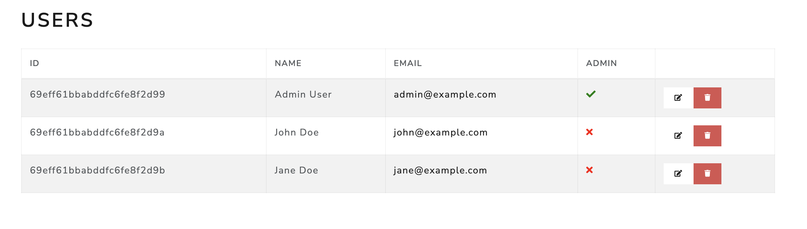 | 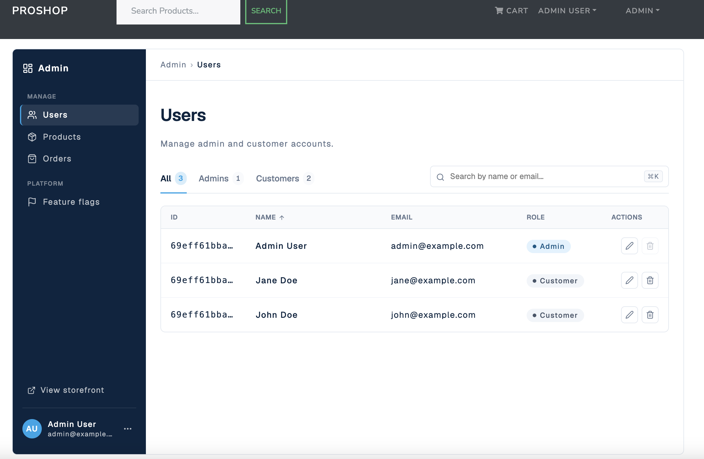 |
| Products | 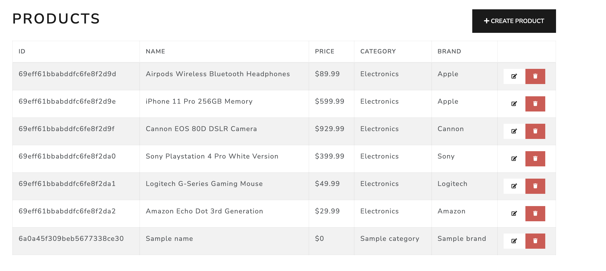 | 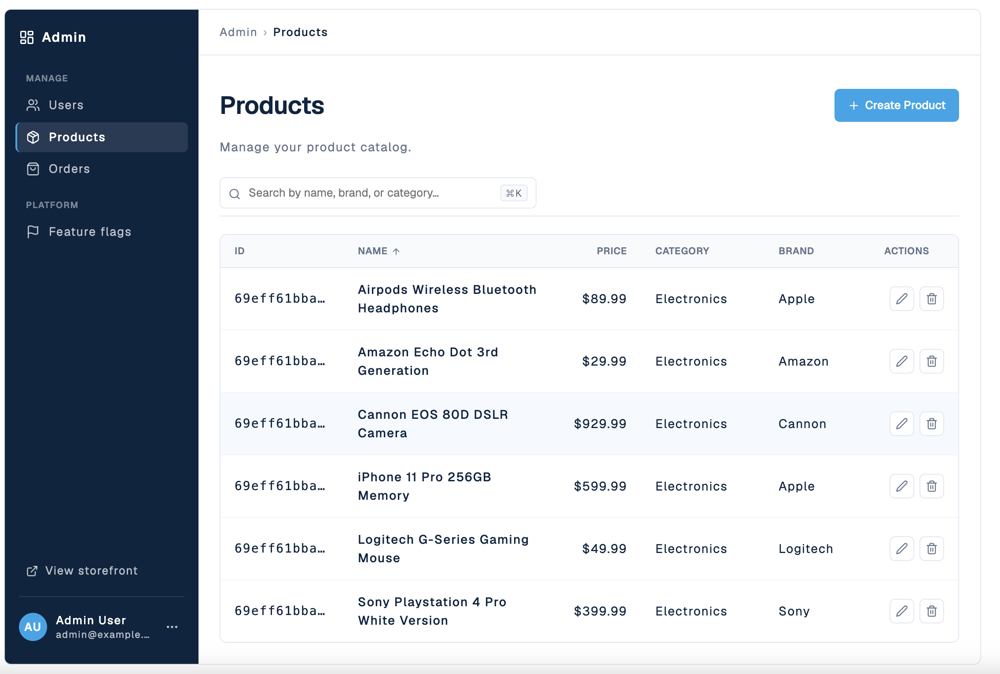 |
| Orders | 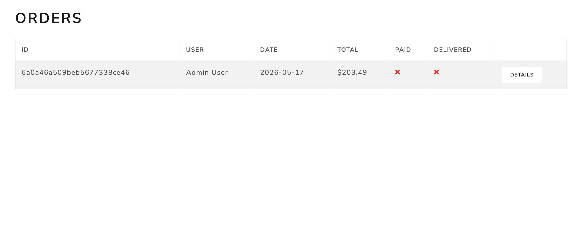 | 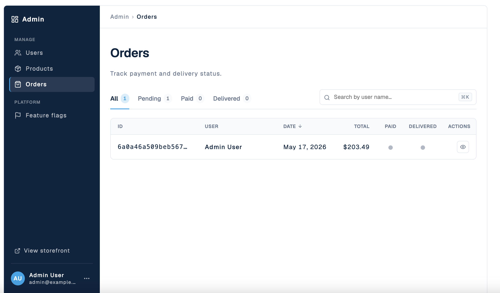 |

What changed across all three:

- Unified admin shell — same sidebar (Users / Products / Orders / Feature flags) and topbar breadcrumb on every page.
- Sortable column headers with focus-visible rings, ⌘K / Ctrl+K to focus search, view-tab filters with counts, chip-based active-filter summary.
- Status indicators — UserList shows an "Admin" role badge; ProductList shows a stock pill; OrderList shows paid / delivered as 10 px binary dots (blue for done, muted gray for pending).
- All four states are wired everywhere — loading skeleton, error alert, empty, data — plus a `?state=…` URL override for demos and screenshots.
- Per-row destructive actions on UserList and ProductList use a modal confirmation (`role="dialog"`, Escape close, focus trap, body scroll lock). OrderList has no destructive action.

Why hybrid D — same reasoning as the Feature Flags Dashboard above (no Tailwind / shadcn on CRA 3.4.3 + webpack 4). The markup is native HTML, so the migration to Tailwind utility classes in M5 / M6 is a class swap, not a rewrite.

Component decisions for the admin pages mirror the Dashboard: built from scratch on native HTML primitives with `--ff-` design tokens — no third-party UI library used.

### Home

The storefront entry point `/` (plus `/page/:n`, `/search/:keyword`, `/search/:keyword/page/:n`) was rewritten as the first **storefront-comfortable** page using the same hybrid D stack. Files live under a new `frontend/src/screens/storefront/` directory that mirrors the `admin/` pattern; future storefront page redesigns (Cart, Product details, etc.) plug into the same foundation.

Before / after:

| Page | Before (Bootstrap) | After (hybrid D) |
|------|--------------------|-------------------|
| Home `/` | 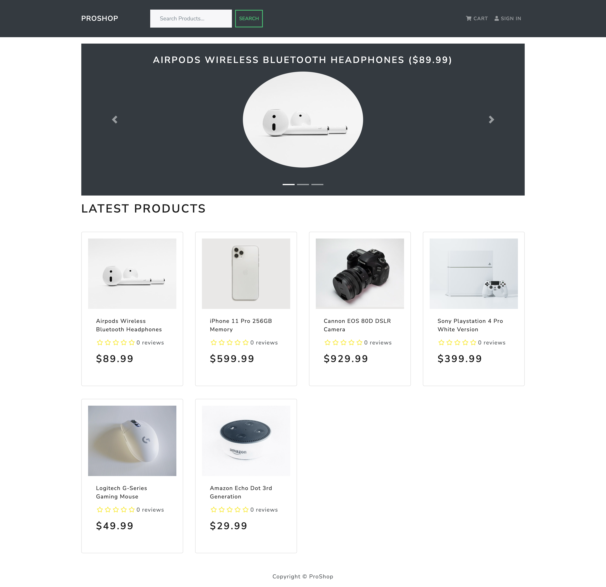 | 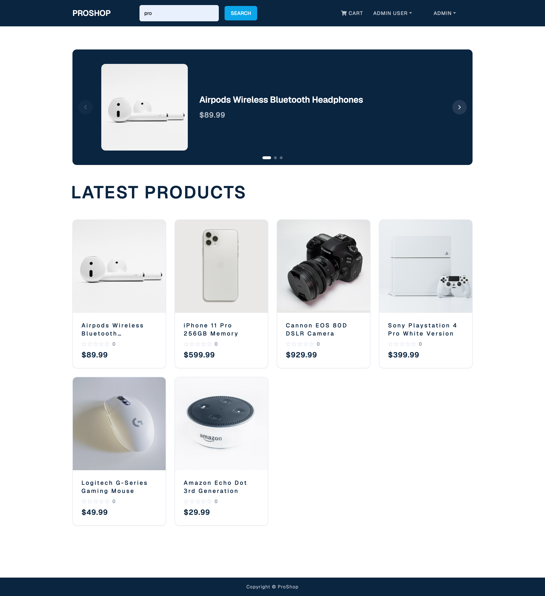 |

What was rebuilt:

- `screens/storefront/HomeScreen.jsx` + `.module.css` — page wrapper, Redux dispatch, route-mode switch (default `/` vs search `/search/:kw`), four wired states (loading skeleton / error / empty / data) plus a `?state=…` URL override for demos.
- `screens/storefront/ProductCard.jsx` + `.module.css` — 1:1 aspect-ratio photo (`aspect-ratio: 1 / 1; object-fit: cover`) with inline SVG `StarIcon` (no FontAwesome dependency), 24 px body padding, subtle hover lift.
- `screens/storefront/ProductCarousel.jsx` + `.module.css` — native HTML slider on Slate-dark band, manual nav only (autorotate off — accessibility + `prefers-reduced-motion`), keyboard control (←/→/Home/End/Esc), three dot indicators, white 1:1 image card to keep the photo's own white background contained inside its boundary.

Design choices baked into the page:

- **Storefront-comfortable density** (per `DESIGN.md`): centered max-width 1200 px, 48 px section gap, h1 48 px Geist hero heading. Distinct from the admin-dense pages above.
- **Grid layout**: CSS Grid `repeat(auto-fill, minmax(240px, 1fr))` — a single rule that fluidly reflows from one column on mobile up to four columns on desktop, with the container max-width as the natural cap. No media queries needed for the grid itself.
- **Search-mode (`/search/:kw`)**: Carousel hidden, h1 reflects `Results for "{keyword}"`, an `aria-live="polite"` count line ("N products found") announces dynamic filter updates to screen readers, plus a plain "Go back" text link to return to the default view.
- **Rating display**: inline SVG `StarIcon` with `variant="full" | "half" | "empty"` per position, driven by the same threshold logic as the legacy `components/Rating.js`. The legacy component is untouched (still used by `ProductScreen` and reviews) — clean removal of FontAwesome is M5/M6 cleanup.
- **Chrome harmonization** (light reskin, no structural change): `components/Header.js`, `Footer.js`, `SearchBox.js` switched from the Bootstrap dark variant to the same Slate `--ff-sidebar-bg` background and Geist font that the admin sidebar uses; the Search button moved from `outline-success` (green) to `--ff-accent` (blue). Layout, dropdowns, and routes are unchanged — the Header redesign as a full surgery is deferred to M5 when the remaining storefront pages migrate.
- **Shared icons moved out of admin scope**: `screens/admin/icons.jsx` → `components/icons.jsx`. The file now houses SVGs used by both admin pages and the new storefront page (Search, Eye, Star, Chevron-Left/Right, Check). All 7 consumer screens import from the new path.

Why hybrid D, not the originally-planned full shadcn pipeline — same reasoning as the rest of M4: CRA 3.4.3 + webpack 4 cannot resolve Radix ESM `.mjs` modules without ejecting, and the markup we ship is native HTML, so the M5 / M6 migration to Tailwind + shadcn is a class-swap rather than a rewrite.

### Cart

The cart page `/cart` (and the `/cart/:id?qty=N` add-to-cart redirect from product pages) was rebuilt as a **Stripe Checkout-style order summary**: compact item rows on the left, a sticky Order summary card on the right.

Before / after:

| Page | Before (Bootstrap) | After (hybrid D) |
|------|--------------------|-------------------|
| Cart `/cart` | 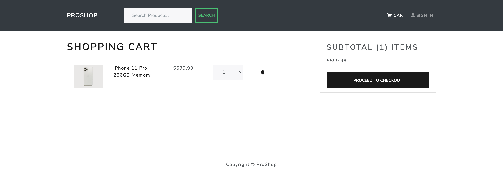 | 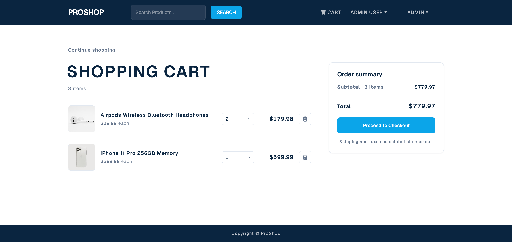 |

What was rebuilt:

- `screens/storefront/CartScreen.jsx` + `.module.css` — page wrapper, two-column grid (items + summary aside), Redux dispatch for `addToCart` / `removeFromCart`, empty-cart state with a "Browse products" CTA, "Continue shopping" back link.
- `screens/storefront/CartItem.jsx` + `.module.css` — single cart row: 80 px thumbnail (1:1), product name with line-clamp, unit price, native `<select>` qty picker, line total, `Trash2Icon` remove button. On mobile (≤ 575 px) the row collapses to a 2-row layout (image + name top, qty + total + remove bottom).

Design choices:

- **Layout**: items column on the left (`minmax(0, 1fr)`), summary on the right at a fixed 340 px sticky aside on desktop. The summary card lives at the top of the right column, aligned with the page heading. Below 992 px the columns stack — items first, summary card after.
- **Order summary card**: white background with the same `--ff-product-card-radius` and shadow as the storefront product cards. Two rows (Subtotal · N items / Total) with a 1 px divider between, then the primary "Proceed to Checkout" button (`--ff-accent`) and a fine-print line about taxes / shipping. No price breakdown beyond subtotal — shipping and taxes are deferred to the checkout flow as in the original spec.
- **Qty selector**: native `<select>` styled to match `--ff-` tokens (1 px border, custom SVG chevron, accent ring on focus). Range is `1..countInStock`. Avoided custom +/- buttons to keep scope minimal.
- **Remove button**: small icon button (`Trash2Icon` from `components/icons.jsx`) with a danger-soft hover background (`--ff-danger-soft-bg`) — same pattern as admin delete buttons in Part 3.

The legacy `frontend/src/screens/CartScreen.js` remains in the tree (no longer imported) until the M4/M5 final cleanup, in case we need to roll back. No backend or Redux changes — `addToCart` / `removeFromCart` actions are reused as-is.

### Product details

The product details page `/product/:id` was rebuilt with a **2-column hero** (image left, meta right) and a reviews section below.

Before / after:

| Page | Before (Bootstrap) | After (hybrid D) |
|------|--------------------|-------------------|
| Product `/product/:id` | 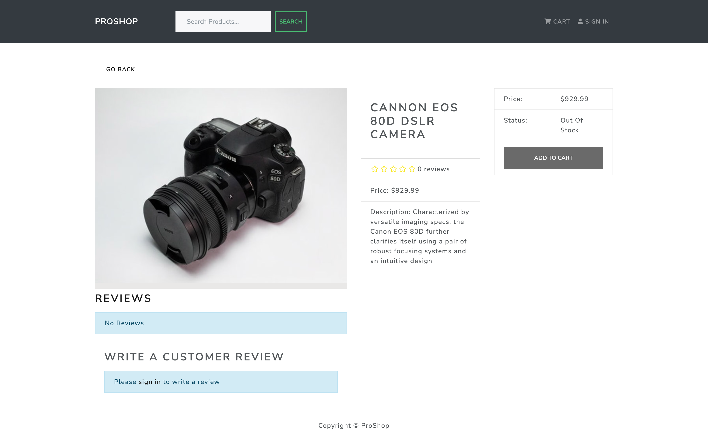 |  |

What was rebuilt:

- `screens/storefront/ProductScreen.jsx` + `.module.css` — page wrapper, Redux dispatch (`listProductDetails`, `createProductReview`), three branches (loading skeleton / error / data), inline `StarRow` helper that reuses the inline SVG `StarIcon` from `components/icons.jsx`.
- Hero section — left column: 1:1 image card with `object-fit: contain` so the product photo's own white background sits cleanly inside the rounded card; right column: h1 name, star rating + review count, large 32 px price, description copy, a pill-shaped in-stock / out-of-stock indicator, qty `<select>`, and a primary `--ff-accent` "Add to cart" button.
- Reviews section — header with title + reviews count, list of review items (name + relative date, star row, comment), and an inline "Write a customer review" form in a subtle gray card. The form has a rating `<select>` (1–5 with labels Poor / Fair / Good / Very good / Excellent), a comment textarea, and a Submit button; submitting disables itself while the action is in flight. When the user is not logged in, the form is replaced by a "Please sign in to write a review" prompt.

Bug fix included with this redesign:

- After a successful review submission the page now refetches product details automatically (`dispatch(listProductDetails)` inside the `useEffect` success branch) so the new review appears in the list without a page reload. The legacy `ProductScreen.js` had the same code path but did not refetch — submitting a review required a manual refresh to see it.

Cross-page polish in the same commit:

- All three storefront back links (`Home` search mode, `Cart`, `Product`) now have a Unicode `←` arrow prefix with a subtle hover-translate-x animation, replacing the earlier plain-text variants. This gives clear "back affordance" without pulling in another SVG icon.

The legacy `frontend/src/screens/ProductScreen.js` remains in the tree (no longer imported) until M4/M5 final cleanup. No backend / Redux action changes — `listProductDetails`, `createProductReview`, and the `PRODUCT_CREATE_REVIEW_RESET` constant are reused.
