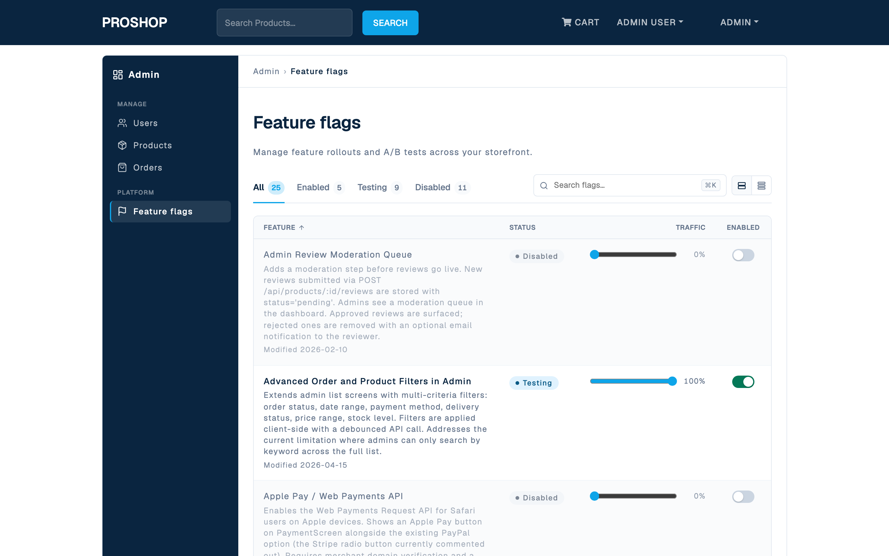
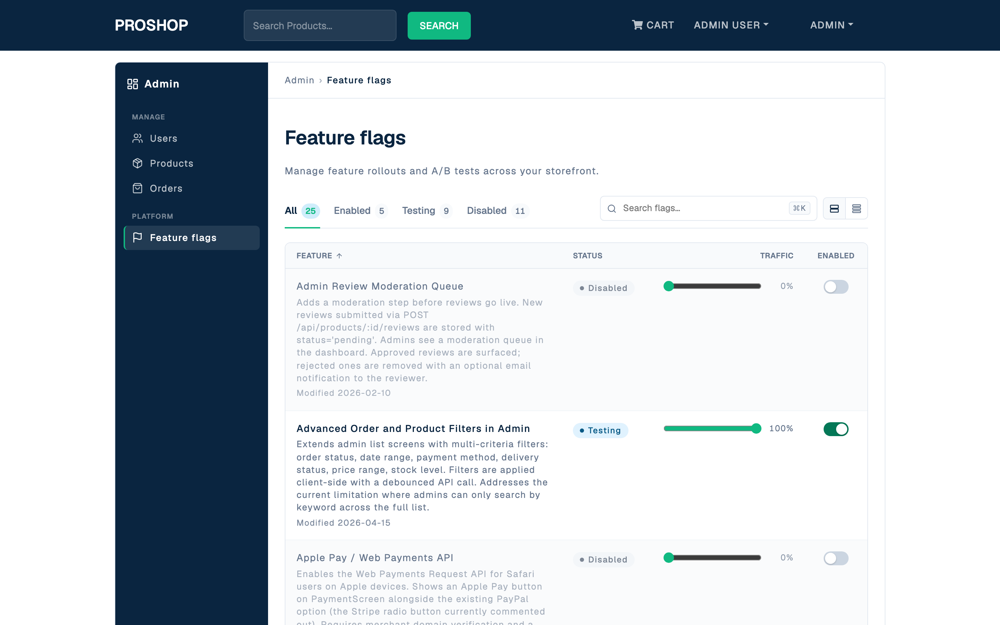

# Selection-mode demo

## What changed

- Token: `--ff-accent` (color.accent.primary in `design-system/tokens.json`)
- Before: `#0EA5E9` (sky-500 — original Stripe-style accent blue)
- After: `#10B981` (emerald-500)

## Files touched

Exactly three single-line edits — confirmed by `git diff --stat`:

```
 design-system/globals.css             | 2 +-
 design-system/tokens.json             | 2 +-
 frontend/src/styles/design-tokens.css | 2 +-
 3 files changed, 3 insertions(+), 3 deletions(-)
```

The actual hunk in each file:

```
- --ff-accent: #0EA5E9;
+ --ff-accent: #10B981;
```

(JSON file has the same value swap inside a one-line entry.)

Nothing else was modified:

- No other tokens in any of the three files (`color.foundations`, `color.sidebar`,
  `color.status`, `typography`, the storefront subset — all untouched).
- No `.module.css` files anywhere in `frontend/src/`.
- No JSX / JS / config files.
- No build artifacts.

## Token economy estimate

- **Naive approach** (regenerate the whole `DESIGN.md` / `globals.css` /
  `tokens.json` via an agent): roughly 5K tokens input (read the whole files)
  plus 2K tokens output (regenerate them). ~7K total per change. Carries a
  drift risk — the LLM may silently "improve" adjacent unrelated values.
- **Selection-mode** (this demo): 3 × 1-line edits ≈ 50 tokens of edit
  instructions plus minimal context. ~100 tokens total. No drift is possible
  because the change is mechanically scoped to the matching lines.
- **Savings:** roughly ×70 on the typical "change one color" operation, plus
  elimination of drift risk.

## Discipline note: the `_note` field stays stale

The `_note` string for `color.accent.primary` in `tokens.json` still reads
"Sky-500, used for primary CTAs and interactive states". This is intentional:
selection-mode optimizes for **minimal diff**, not for keeping every comment
in lockstep. The value of the token is the source of truth; the human-readable
note in `_note` is documentation and can be reconciled in a follow-up pass if
the change is permanent. For a demo override like this one, the stale `_note`
is an explicit feature, not a bug — it makes the discipline visible.

## Before / After





The accent affects:

- the header `SEARCH` button background,
- the active-tab underline ("All 25"),
- the traffic-percentage slider tracks in the Feature flags table.

The "Enabled" toggle on-state and the "Testing" badge use other tokens
(`--ff-status-enabled-*` and `--ff-status-testing-*`) and are not touched
by this demo — though the toggle's green now happens to harmonize with the
new emerald accent.

## Pattern reuse

The same selection-mode approach applies to any token category:

- **Typography:** change `--ff-font-sans` — affects all text site-wide.
- **Spacing:** change `--ff-storefront-section-gap` — affects only storefront
  page layout, not the admin-dense tables.
- **Status colors:** change one of `--ff-status-enabled-text`,
  `--ff-status-testing-text`, etc. — affects only the badges.
- **Storefront density:** change `--ff-card-padding-storefront` — affects the
  product cards, leaves admin tables alone.

The discipline: identify the single category being changed, edit only the
matching lines in `tokens.json` + `globals.css` + `design-tokens.css`, commit
atomically. Three single-line edits, never a regeneration.

## Revert

To restore the original Stripe-style accent blue:

```bash
git diff HEAD -- design-system/ frontend/src/styles/design-tokens.css
# then either: git checkout HEAD -- <those files>
# or: edit the three lines back to #0EA5E9
```

This demo intentionally leaves the change committed (the deliverable *is*
the selection-mode change). If you want the visual identity back to
Stripe-style blue, revert via a follow-up commit.
